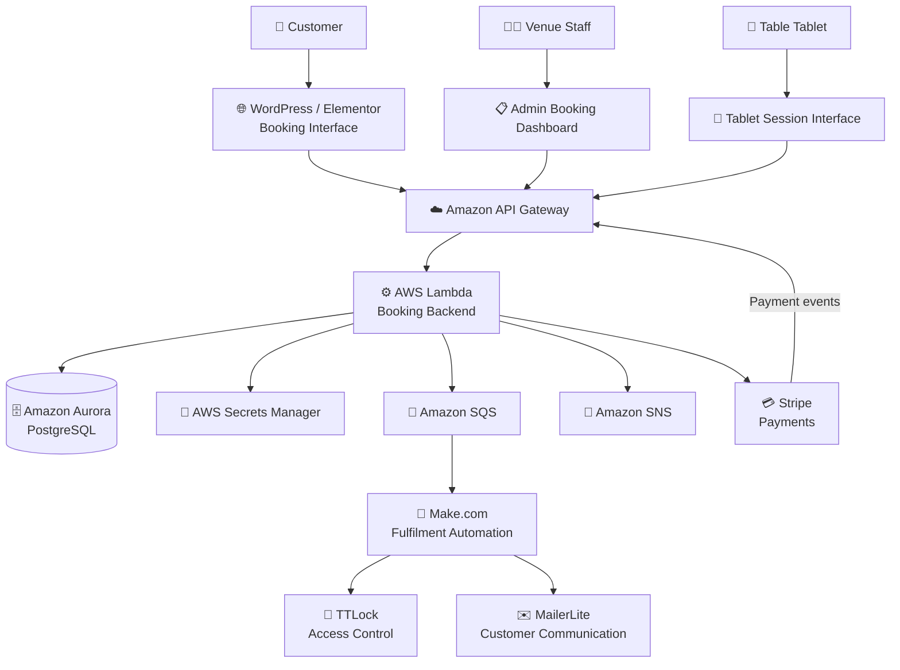
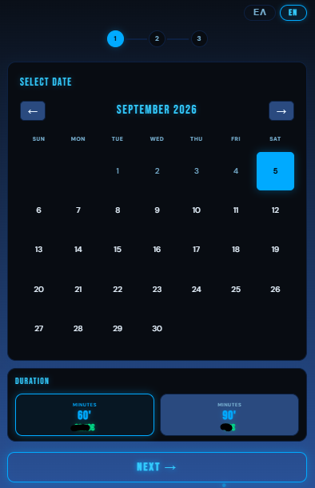
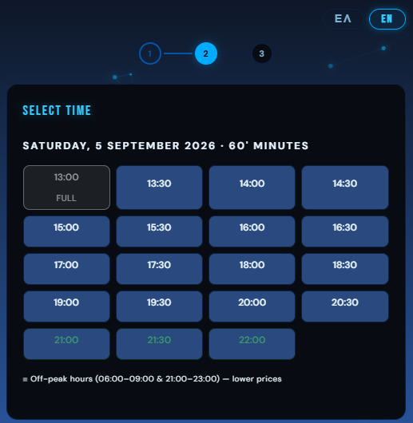
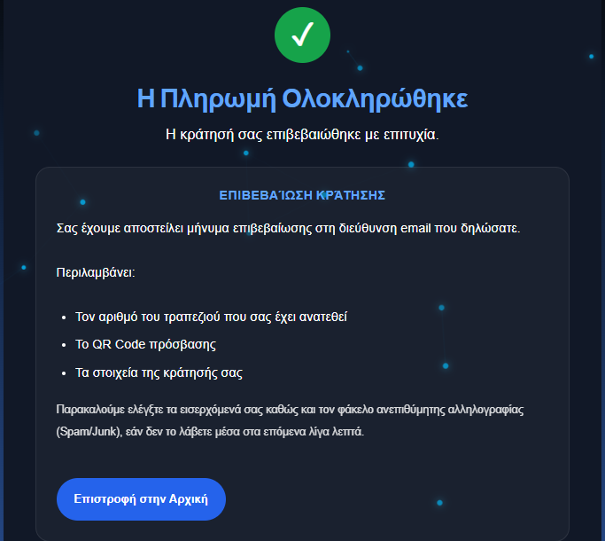
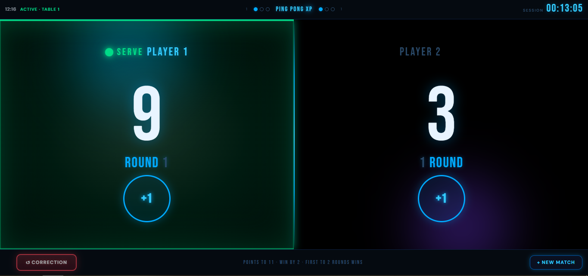
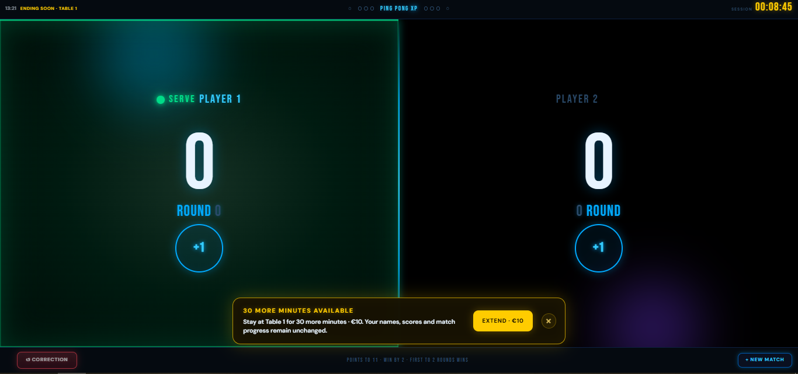
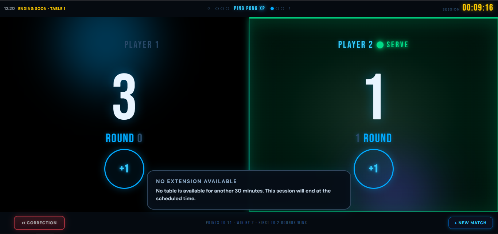
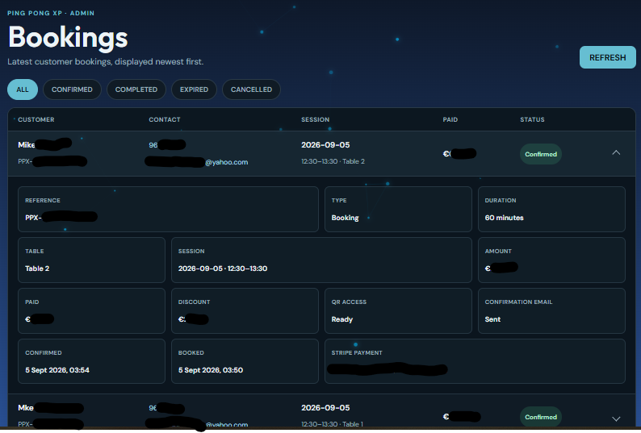

# Ping Pong XP Booking Platform 🏓

### Cloud-Based Booking, Payment, Session & Access-Control Platform

Ping Pong XP is a real-world booking and venue-management platform developed for a table-tennis venue in Cyprus.

The platform supports the full customer journey from booking availability and payment through booking confirmation, session management, access control, extensions, and administrative operations.

> This public repository is a portfolio representation of the production system. Sensitive credentials, customer data, production configuration, and certain operational details are intentionally excluded.

---

## 🚀 Project Overview

The platform was designed to replace a slower automation-heavy booking workflow with a more reliable cloud-based architecture.

It combines a WordPress customer-facing interface with an AWS backend, PostgreSQL database, Stripe payments, automated fulfilment, and smart access-control integration.

---

## 🛠️ Tech Stack

**Frontend**

- JavaScript
- HTML
- CSS
- WordPress
- Elementor

**Backend & Cloud**

- AWS
- API Gateway
- AWS Lambda
- Amazon Aurora PostgreSQL
- AWS Secrets Manager
- Amazon SQS
- Amazon SNS

**Payments & Integrations**

- Stripe
- TTLock
- Make.com
- MailerLite

**Development**

- REST APIs
- Git
- GitHub
- AWS CLI

---

## 🏗️ System Architecture

The platform separates the customer-facing WordPress interface from the booking backend and database. AWS services handle booking logic, persistence, payment processing, fulfilment, and operational reliability.

### Main Responsibilities

**WordPress**

- Customer booking experience
- Administration interface
- Venue tablet interfaces

**AWS Backend**

- Availability validation
- Booking holds
- Pricing and booking rules
- Booking confirmation
- Session extensions
- Idempotency and duplicate protection
- Administrative API operations

**Aurora PostgreSQL**

- Persistent booking and session data
- Booking status and fulfilment state

**Stripe**

- Secure customer payments
- Payment-event driven booking confirmation

**SQS & Make.com**

- Asynchronous fulfilment
- Access-code generation
- Customer communication

**SNS**

- Operational alerts for backend failures and important system events

✨ Core Features
Booking Availability

Customers can:

Select a booking date
Choose a session duration
View available time slots
Select an available table
Enter booking details
Proceed to secure payment

Availability is validated by the backend before the booking continues.

Temporary Booking Holds

The platform creates temporary reservation holds before payment.

This prevents two customers from successfully purchasing the same booking slot at the same time.

The backend includes:

Hold expiration
Availability revalidation
Duplicate-request protection
Idempotent booking operations
Stripe Payments

Stripe Checkout is used to process online payments.

Booking information is associated with the payment flow so the backend can safely confirm the corresponding reservation once payment succeeds.

Payment Fulfilment

After a successful payment, the system:

Validates the Stripe event
Locates the corresponding booking
Confirms the booking
Initiates access-control fulfilment
Sends booking information to the customer
Records fulfilment status

Processing is designed to be safe against duplicate payment events.

Smart Access Control

The platform integrates with TTLock-based access hardware.

Confirmed customers receive temporary access associated with their booking period.

Access is restricted to the relevant reservation window.

Session Extension

Customers using the venue tablet can request additional playing time near the end of their session.

The platform:

Checks availability after the current booking
Prevents overlap with upcoming reservations
Supports extension payment
Updates the booking/session state after confirmation
Tablet Session Interface

Each table can use a dedicated session screen displaying:

Current booking
Session countdown
Player names
Score tracking
Table-tennis match logic
Round / game information
Extension availability
Table-Tennis Scoring

The tablet interface includes match logic based on standard table-tennis scoring concepts:

Games played to 11 points
Two-point winning margin
Best-of-five match support
Game / round tracking
Match reset for additional games during the session
Admin Booking Dashboard

A protected WordPress administration interface allows venue staff to view booking information.

Bookings can be viewed by status such as:

Confirmed
Completed
Pending
Expired
Cancelled

The dashboard retrieves booking information directly from the backend API.

Operational Reliability

The backend includes mechanisms designed for production reliability, including:

Idempotency
Duplicate-event protection
Retry-safe fulfilment
Booking-state validation
Secret management
Operational alerts
Error handling
🗄️ Database

The production system uses Amazon Aurora PostgreSQL.

Booking records contain information related to:

Booking reference
Date and time
Duration
Table
Customer booking details
Booking status
Payment status
Extension information
Fulfilment state
Access-control state

Real customer records are not included in this repository.

🔐 Security

Sensitive production information is intentionally excluded from this public repository.

This includes:

AWS credentials
Database credentials
Stripe secrets
Webhook secrets
TTLock credentials
Make.com secrets
MailerLite API keys
Admin API secrets
Production customer information

Example configuration values are provided through .env.example where appropriate.

📁 Repository Structure
ping-pong-xp-booking-platform/
│
├── README.md
├── .gitignore
├── .env.example
│
├── docs/
│ ├── architecture/
│ └── screenshots/
│
├── backend/
│
├── frontend/
│ ├── booking/
│ ├── tablet/
│ └── admin/
│
└── infrastructure/

The repository contains selected and sanitized examples from the wider production system.

## 📸 Screenshots

### Customer Booking Interface

The customer-facing booking flow allows users to select a date, session duration, and available time before proceeding to payment, tables are assigned automatically based on availability.

---

### Booking Confirmation

After successful payment and fulfilment, the customer receives confirmation of their reservation and access information.

---

### Tablet Session Interface

Each table uses a dedicated tablet interface for session management, countdown timing, player scoring, and match tracking.

---

### Session Extension

Near the end of a session, the system checks future availability and can offer additional playing time without overlapping an upcoming reservation.

---

### Admin Booking Dashboard

Venue staff can view booking records and filter reservations by booking status through a protected administration interface.

📌 Project Status

Ping Pong XP is an operational real-world system.

This repository serves as a public technical portfolio demonstrating the architecture, engineering decisions, user interfaces, and selected implementation work while keeping production-sensitive information private.

👤 Author

Joe Zeinaty

Computer Science Graduate
Junior Software Developer

GitHub: joe-zeinaty
